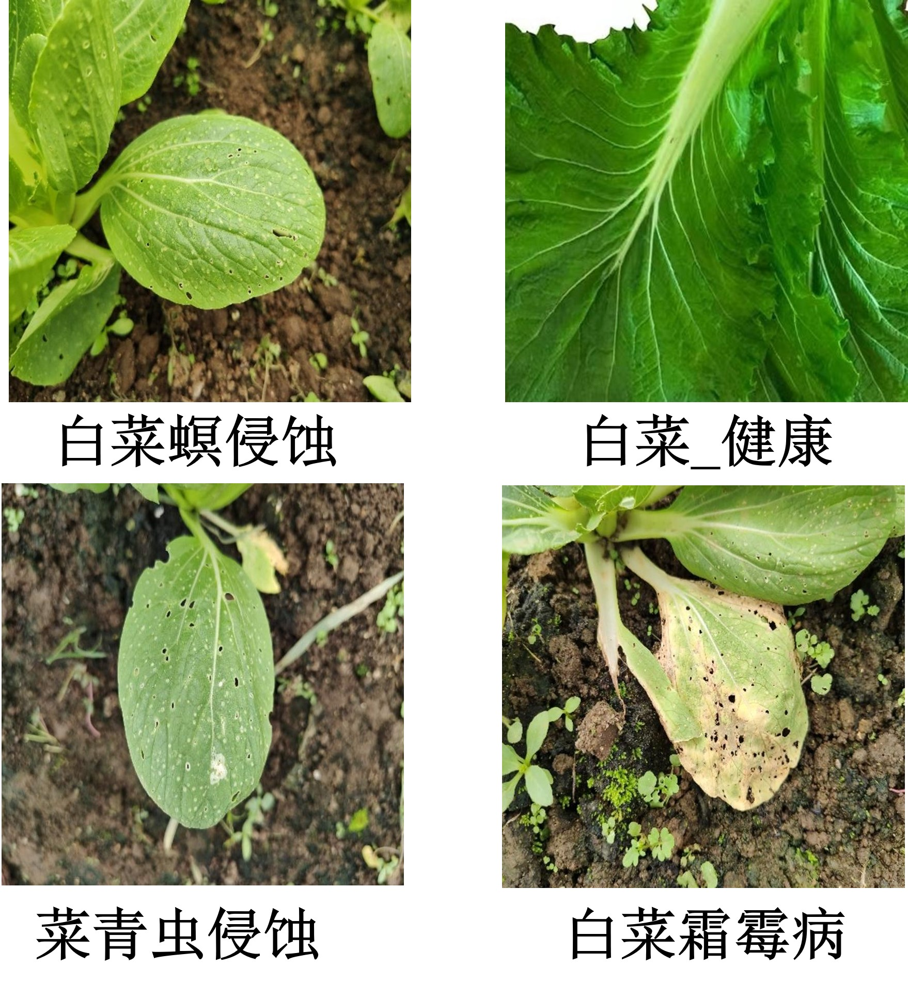
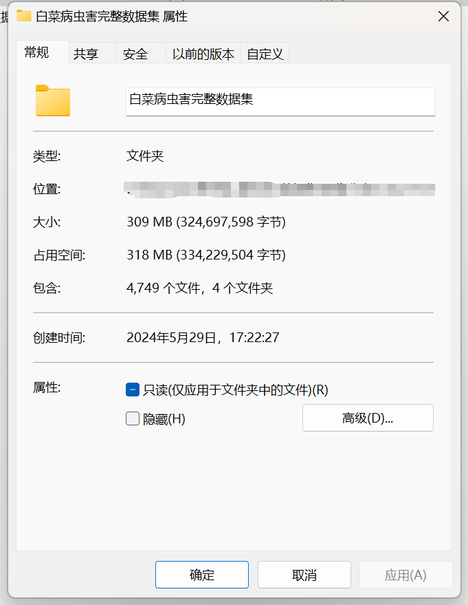
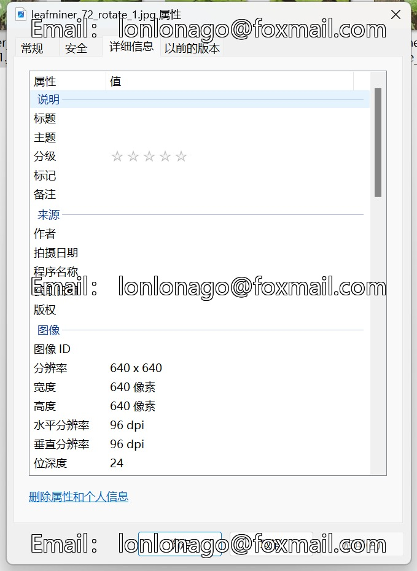

# The Chinese Kale Diseases and Pests Dataset

Comprehensive Dataset Introduction: Images in the folder "Healthy Chinese Kale" number: 872
Images in the folder "Chinese Kale Maggot Infestation" number: 1793
Images in the folder "Green Leafhopper Infestation" number: 1332
Images in the folder "Blight Disease" number: 752
Total images from all subfolders: 4749
Dataset Image Examples:
For inquiries, just ask directly. No need for friend verification; you can send messages to me without my approval. I can see them.
Search for me, and send all your questions at once. I will reply to you. Sometimes I am busy; please describe your question and intention clearly when you contact me.
I will also reply to you when I am free; there's no need for formalities, which makes it more efficient.
Phone numbers are the same as above; if I forget to reply or you are impatient, you can also send a text message or call.

## Images

Here is a pay link on Stripe ( https://buy.stripe.com/3cs8yP7sY87d0vu9AB ). Please contact me lonlonago@foxmail.com after funding $89, and I will send you a complete data files , thank you!

